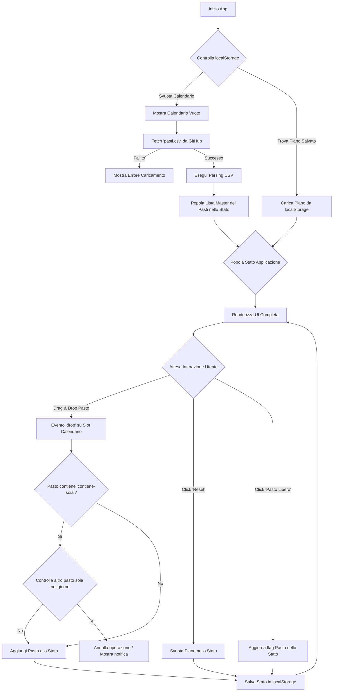

# Architettura: Protocollo Dinamico v1.0

## 1. Principi Guida
* **Frontend-Only:** Nessun server, nessun backend. L'app vive interamente nel browser.
* **KISS (Keep It Simple, Stupid):** Utilizzare Vanilla JavaScript, HTML e CSS. Nessun framework.
* **SRP (Single Responsibility Principle):** Ogni funzione e ogni file deve avere una sola, chiara responsabilità.

## 2. Diagramma di Flusso (Flowchart)
Questo diagramma descrive il ciclo di vita e la logica dell'applicazione.



## 3. Struttura dei File
La struttura dei file è progettata per la massima modularità e leggibilità.

```
.
├── index.html              # Entry point dell'applicazione
├── style.css               # Stili globali e dei componenti
└── src/
    ├── main.js             # File principale, inizializza l'app
    ├── api/
    │   └── mealService.js  # Funzione per fetch e parsing del CSV
    ├── core/
    │   ├── state.js        # Gestione dello stato centrale dell'app
    │   └── validation.js   # Logica per la regola della soia
    ├── ui/
    │   ├── calendar.js     # Funzioni per renderizzare e aggiornare la griglia
    │   ├── library.js      # Funzioni per renderizzare la libreria dei pasti
    │   └── interactions.js # Gestione degli eventi (drag & drop, clicks)
    └── utils/
        └── constants.js    # Costanti come l'URL del CSV e le chiavi del localStorage
```

## 4. Gestione dello Stato
L'intero stato dell'applicazione sarà gestito da un singolo oggetto JavaScript in `src/core/state.js`.

**Struttura dello Stato Iniziale:**
```javascript
{
  // Lista di tutti i pasti caricati dal CSV
  masterMealList: [],
  // Oggetto che mappa gli slot del calendario ai pasti pianificati
  // Esempio: { 'lunedi-pranzo': mealId_1, 'martedi-cena': mealId_2, ... }
  weeklyPlan: {},
  // Stato dei filtri UI
  uiFilters: {
    type: 'all' // 'pranzo', 'cena'
  }
}
```
Ogni funzione che modifica lo stato (es. `addMealToPlan`, `clearPlan`) dovrà essere definita in `state.js` e dovrà essere l'unica a poter mutare questo oggetto. Dopo ogni modifica, verrà emesso un evento custom per notificare all'UI di ri-renderizzarsi.
